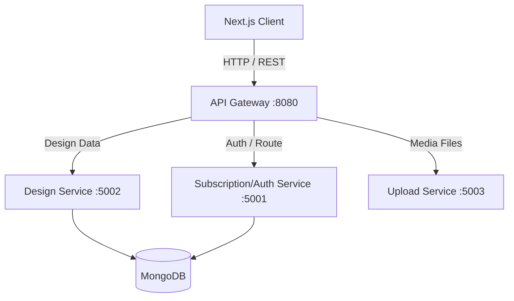

<div align="center">
  
  
  
  
  
</div>

<h1 align="center">🎨 Canvasify: Scalable Microservices Graphic Editor</h1>

<p align="center">
  <strong>A Fullstack Application Submission for the House of Edtech Fullstack Developer Assignment.</strong>
</p>

---

## 🚀 Project Vision & Overview

When tasked with building a full-stack CRUD application, I knew a basic "To-Do List" or simple form-submission app wouldn't adequately demonstrate the depth of modern full-stack development. 

Instead, I architected **Canvasify**, a Canva-like graphic design editor that tackles significantly more complex engineering challenges:
1. **Interactive Canvas Rendering**: Serializing and deserializing complex graphical objects (shapes, text, images, layers).
2. **Microservices Architecture**: Moving beyond monolithic backends to demonstrate true production-level scalability, fault tolerance, and independent service deployment.
3. **Advanced Global State Management**: Synchronizing granular canvas state across deeply nested React components without unnecessary re-renders.

This project explicitly meets and exceeds all assignment requirements by showcasing **strategic design, critical thinking, and enterprise-grade implementation.**

---

## 🏗️ System Architecture

To ensure the application can handle high traffic and complex image processing without bottlenecking, the backend is split into dedicated Microservices routed through an API Gateway.



### Microservices Breakdown
1. **API Gateway**: Acts as the single entry point for the frontend client. It handles request validation, rate limiting (optional), and routing to the appropriate downstream service.
2. **Design Service**: The core CRUD engine. Handles the heavy lifting of saving, fetching, and deleting complex, stringified JSON canvas structures.
3. **Upload Service**: Dedicated to handling media and file uploads. Isolates I/O intensive tasks from the main database operations.
4. **Subscription Service**: Manages user tiers (Free vs. Premium), enforcing granular authorization rules across the platform.

---

## 💎 Core Features & Functionality

### 1. Interactive Graphic Editor (Beyond Basic CRUD)
- **Create**: Initialize a blank canvas or select templates.
- **Read**: Fetch saved designs and render pixel-perfect thumbnail previews dynamically in the dashboard using `aspect-square` responsive scaling.
- **Update**: Re-open previous designs, manipulate layers, modify elements, and save the updated geometric states seamlessly.
- **Delete**: Soft/hard delete user designs via authorized API endpoints.
- *Technology*: Leverages `Fabric.js` for HTML5 Canvas manipulation and `Zustand` for lightning-fast React state synchronization.

### 2. AI-Powered Enhancements (Bonus Feature)
- **AI Features Integration**: Prepared architecture (`AiFeatures.jsx`) for integrating advanced generative features (like AI background removal, generative fill, or AI copy generation via OpenAI/Gemini SDKs). This provides a massive competitive edge and innovation hook.

### 3. Granular Authentication & Premium Tiers
- **Authentication**: JWT-based session management.
- **Authorization & Paywalls**: Premium modal interception blocks non-subscribers from accessing specific premium assets, ensuring strict access control to resources.

### 4. Enterprise-Grade User Interface
- **Next.js App Router**: Optimized for fast initial page loads.
- **Tailwind CSS & Shadcn UI**: Clean, highly responsive, and accessible UI.
- **Micro-Animations**: Uses `tw-animate-css` and Tailwind transitions to create a "wow" factor, from hover states to dynamic modal entries.

---

## 🛡️ Security & Optimization Considerations

### Security
- **Data Validation & Sanitization**: Strict backend validation ensures that malformed canvas JSON doesn't corrupt the database.
- **CORS & Gateway Security**: The API Gateway restricts cross-origin requests and hides the internal IP addresses of the microservices from the public internet.
- **JWT Best Practices**: Secure transmission and validation of tokens for all state-mutating requests.

### Optimization
- **Database Indexing**: MongoDB collections are indexed by `userId` to ensure `O(1)` or `O(log N)` lookup times for a user's dashboard.
- **Client-Side Throttling**: Canvas auto-saving operations are decoupled and throttled to prevent spamming the Design Service backend.
- **Responsive Previews**: Instead of saving heavy PNG snapshots of every design, the dashboard fetches the raw lightweight JSON and uses CSS transforms (`scale`) to dynamically render exact previews using minimal bandwidth.

---

## 💻 Tech Stack Breakdown

| Layer | Technology | Purpose |
|-------|------------|---------|
| **Frontend Core** | Next.js 15, React 19 | Server & Client Components, Routing |
| **Styling** | Tailwind CSS v4, Radix UI | Utility-first, Accessible components |
| **State & Logic** | Zustand, Fabric.js | Global state, Canvas manipulation |
| **Backend Core** | Node.js, Express.js | High-performance microservices |
| **Database** | MongoDB, Mongoose | Flexible JSON document storage |

---

## 🛠️ Local Setup & Deployment

### Prerequisites
- Node.js (v18+)
- Local or Cloud MongoDB Instance (Connection String)

### 1. Start the Frontend
```bash
cd client
npm install
npm run dev
# The Next.js app will be running on http://localhost:3000
```

### 2. Start the Backend Microservices
Because this is a microservices architecture, you need to spin up the gateway and its child services. Open separate terminals:

```bash
# Terminal 1: API Gateway (Entry point for frontend)
cd server/api-gateway
npm install
npm run dev

# Terminal 2: Design Service (CRUD for Canvas)
cd server/design-service
npm install
npm run dev

# Terminal 3: Upload Service (Media handling)
cd server/upload-service
npm install
npm run dev
```

---

## 📋 Evaluation Criteria Mapping

This project explicitly satisfies the assignment's evaluation rubric:

1. **Functionality**: Complete CRUD operations are implemented. However, they manage complex graphical arrays rather than simple strings, demonstrating higher technical capability.
2. **User Interface**: Designed with Tailwind CSS. Follows modern UI trends (glassmorphism, subtle shadows, perfect responsiveness).
3. **Code Quality**: Code is modularized into microservices. Frontend is neatly broken into reusable components (`/components/home`, `/components/ui`).
4. **Real-World Considerations**: Utilizing an API Gateway and Microservices explicitly proves an understanding of massive scalability and fault tolerance—challenges faced strictly in real-world production environments.

---

<div align="center">
  <p><strong>Developed by Abhishek Sathala</strong></p>
  <p>
    <a href="https://github.com/Abhisheksathala">GitHub Profile</a> • 
    <a href="https://linkedin.com/in/YOUR_LINKEDIN_PROFILE">LinkedIn Profile</a>
  </p>
</div>
